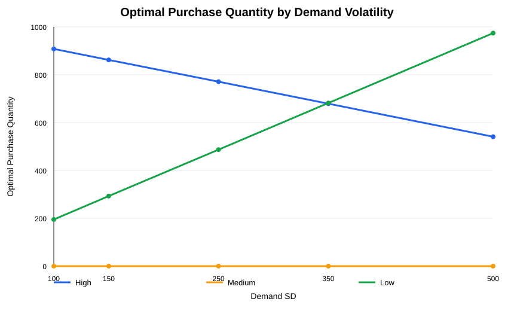
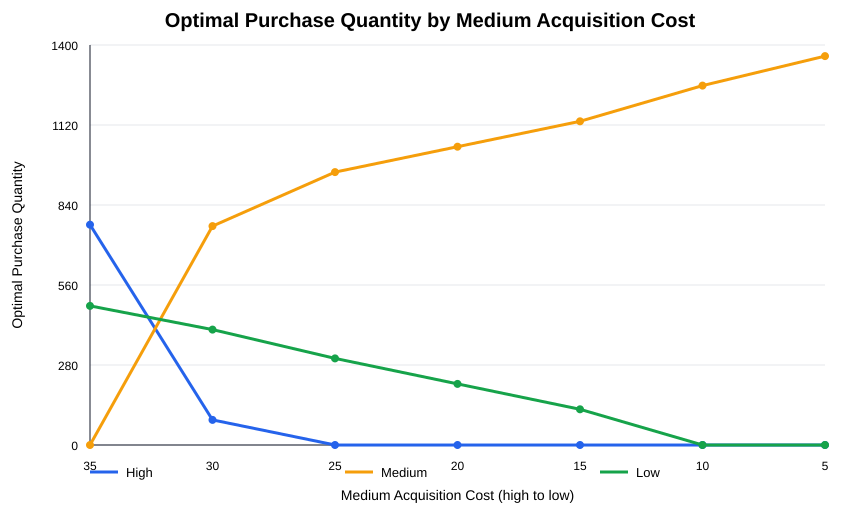

# ReCellular Inventory Planning

An inventory-planning portfolio project that examines how a remanufacturer can choose a mix of product grades before demand is known. The project combines an interpretable Excel model, mixed-integer linear programming (MILP), Monte Carlo validation, and sensitivity analysis.

All profits and operating measures in this repository are simulated model outputs, not actual ReCellular business results.

## Business problem

ReCellular must purchase used phones before observing customer demand. Available phones are graded High, Medium, or Low. Every grade sells for the same price after remanufacturing, but the grades have different acquisition costs, remanufacturing costs, and exposure to unsold-inventory risk.

The decision is how many units of each grade to purchase in order to maximize expected profit while balancing:

- Higher margin against higher acquisition exposure.
- Product availability against excess inventory.
- Demand fulfillment against the cost of carrying units that may not sell.

| Grade | Acquisition cost | Remanufacturing cost | Selling price |
|---|---:|---:|---:|
| High | $50 | $30 | $120 |
| Medium | $35 | $50 | $120 |
| Low | $5 | $85 | $120 |

Baseline demand follows `Normal(mean=1000, sd=250)`, rounded to whole units using Excel's half-away-from-zero rule and truncated at zero. Unsold inventory has zero salvage value.

For each demand scenario:

```text
Profit = sales revenue
       - acquisition cost for all purchased units
       - remanufacturing cost for units sold
```

Because the selling price is identical across grades and High has the lowest remanufacturing cost, followed by Medium and Low, available inventory is sold in High → Medium → Low order.

## Approach

### Excel model

[`data/ReCellular_Inventory_Planning.xlsx`](data/ReCellular_Inventory_Planning.xlsx) contains the model inputs, 100 frozen demand scenarios, purchase decisions, scenario calculations, and average-profit objective. It provides a transparent view of the two-stage decision logic:

1. Purchase High-, Medium-, and Low-grade inventory before demand is observed.
2. Remanufacture and sell available inventory after each scenario's demand is known.

### MILP optimization

The Python MILP uses nonnegative integer purchase quantities as first-stage decisions and scenario-specific sales quantities as recourse decisions. HiGHS verifies optimality for each finite optimization sample, and the scripts independently recalculate profit using the Excel allocation logic.

Two optimization samples serve different purposes:

- The **100-scenario model** uses the fixed demand values stored in Excel and provides a directly auditable link between the workbook and MILP.
- The **5,000-scenario model** uses a larger seed-42 training sample to estimate a sample-average purchasing policy and support the sensitivity analyses.

Neither result is a claim of global optimality for the continuous Normal demand distribution.

### Monte Carlo validation

Four fixed strategies are evaluated on the same independent set of 10,000 demand scenarios generated with `default_rng(2026)`. This validation sample is not used to optimize or select purchase quantities.

## Key findings

### Optimized purchasing policies

| Optimization sample | High | Medium | Low | Training average profit | Solver status |
|---|---:|---:|---:|---:|---|
| 100 frozen Excel scenarios | 788 | 0 | 451 | $34,393.30 | Optimal; gap 0 |
| 5,000 seed-42 scenarios | 771 | 0 | 487 | $34,180.46 | Optimal; gap 0 |

The two policies differ because they were optimized on different finite training samples.

### Independent validation results

| Strategy | Purchase mix (H/M/L) | Average profit | Average unmet demand | Average leftover inventory |
|---|---:|---:|---:|---:|
| H1000 | 1000 / 0 / 0 | $30,890.69 | 100.70 | 101.21 |
| Mix-2 | 965 / 0 / 302 | $33,002.19 | 17.87 | 285.39 |
| 100-scenario policy | 788 / 0 / 451 | $34,317.97 | 22.25 | 261.77 |
| 5,000-scenario policy | 771 / 0 / 487 | $34,343.25 | 19.20 | 277.71 |

On the shared validation sample, the 100-scenario policy earns $1,315.78 more average profit than Mix-2. The 5,000-scenario policy earns $25.29 more than the 100-scenario policy. These differences describe this simulation sample and should not be interpreted as realized business gains.

Full-precision results are available in [`results/independent_sample_validation_seed2026_results.csv`](results/independent_sample_validation_seed2026_results.csv).

## Business insights

### Demand volatility changes the preferred grade mix

As demand standard deviation rises from 100 to 500, the optimized High quantity falls from 908 to 541 while Low rises from 195 to 974. Medium remains at zero for the tested baseline cost structure.

This pattern reflects the cost of uncertainty: High units have stronger margins when sold but require more acquisition cash upfront, whereas Low units provide cheaper protection against high-demand outcomes. In the independent validation results, greater volatility is also associated with higher unmet demand, more leftover inventory, and lower average profit.



Detailed results: [`results/demand_volatility_sensitivity_results.csv`](results/demand_volatility_sensitivity_results.csv)

### Medium becomes attractive when its acquisition cost falls

At the baseline Medium acquisition cost of $35, the optimized quantity is zero. At the next tested price point, $30, Medium enters the solution with 766 units and replaces much of the High inventory. As its acquisition cost declines further, Medium becomes the dominant grade in the tested purchasing mix.

This shows that Medium's absence from the baseline solution is a consequence of its relative cost position, not a structural restriction in the model.



Detailed results: [`results/medium_acquisition_cost_sensitivity_results.csv`](results/medium_acquisition_cost_sensitivity_results.csv)

## Reproducibility

Python 3.12.14 was used to verify the repository with HighsPy 1.15.1, NumPy 2.5.3, and openpyxl 3.1.5.

```bash
python3 -m venv .venv
source .venv/bin/activate
python -m pip install -r requirements.txt

python scripts/global_optimality_validation.py
python scripts/independent_sample_validation.py
python scripts/demand_volatility_sensitivity.py
python scripts/medium_acquisition_cost_sensitivity.py
```

Run the commands from the repository root. The scripts use project-relative paths and write their CSV, SVG, and HiGHS evidence files under `results/`.

```text
data/                 Sanitized Excel model with 100 frozen scenarios
scripts/              Optimization, validation, and sensitivity analyses
results/              CSV outputs and HiGHS solver evidence
results/figures/      Sensitivity-analysis charts
```

The 100-scenario optimality certificate and complete solver log are stored in [`results/global_optimality_validation_evidence.csv`](results/global_optimality_validation_evidence.csv) and [`results/global_optimality_validation_highs.log`](results/global_optimality_validation_highs.log).

## Limitations

- The project uses simulated demand and teaching-case parameters rather than current company operating data.
- The precise bibliographic source for the case parameters has not been independently verified.
- HiGHS proves optimality for each finite scenario sample, not for the full continuous demand distribution.
- The model assumes zero salvage value and excludes capacity, budget, lead-time, supply uncertainty, and minimum-order constraints.
- Sample-average solutions depend on the recorded random seeds and finite scenarios.
- Sensitivity analyses vary one factor at a time and do not establish causal relationships.
